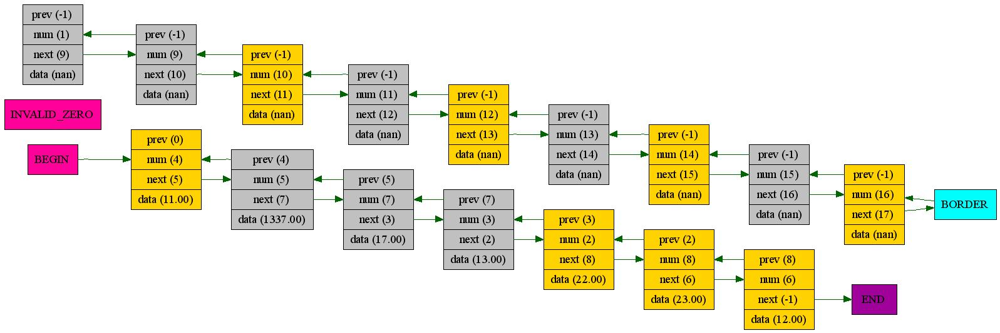

# List (not default)
## Constructed on array of structures

* Previous elements  
* Data  
* Next elements  

This list is more comfortable to use and more faster then default list. 

Here you can see example of my lists graph:  

✨Have fun using it instead of std::list!
